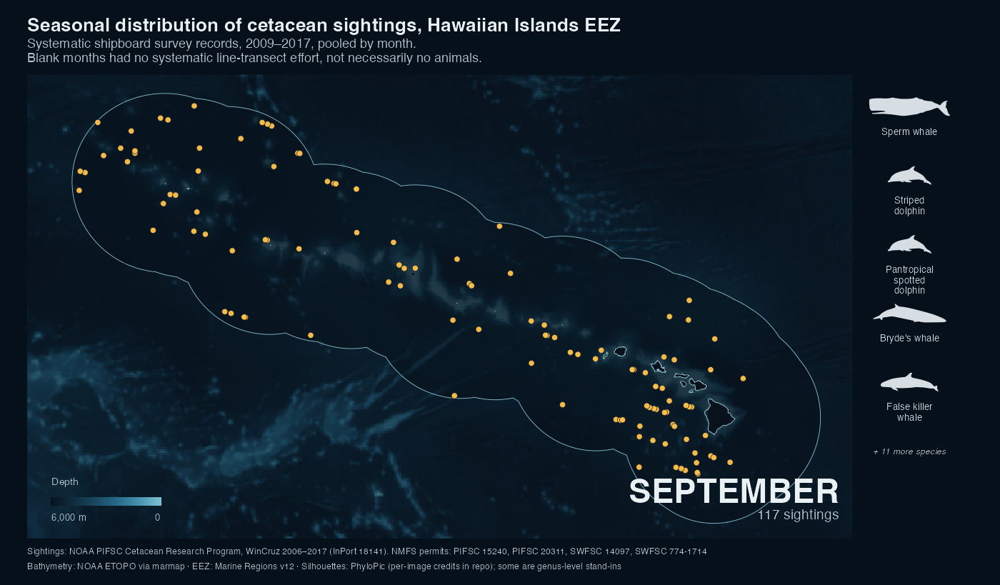

# hawaii-cetacean-seasonality

Seasonal distribution of systematic cetacean sighting records in the Hawaiian
Islands EEZ, from NOAA PIFSC shipboard surveys, 2009–2017.



A twelve-frame animation, January to December, of every systematic
species-identified sighting in the public WinCruz record. Bathymetry
underneath, EEZ boundary outlined, the species seen that month down the right.

Full animation: [`outputs/hawaii_cetacean_seasonal.mp4`](outputs/hawaii_cetacean_seasonal.mp4)
Written report: [theophilemt92.github.io/hawaii-cetacean-seasonality](https://theophilemt92.github.io/hawaii-cetacean-seasonality)

## What the map shows, and what it does not

It shows **sighting records, not animals**. The public dataset contains
sightings only — there is no trackline or effort file — so the map describes
where observations were written down, not where cetaceans are.

Blank months are months with **no systematic line-transect effort**. That is
not the same as no survey activity, and certainly not no animals. March and
April both carry records under other effort types; December carries none at
all.

## From 1,492 records to 370 sightings

| step | n |
|---|---|
| all records | 1,492 |
| cetaceans (excludes turtles, monk seal) | 1,491 |
| identified to species | 1,042 |
| Hawaiian Islands EEZ | 882 |
| systematic effort | **370** |

370 sightings across **24 species**, from nine cruises between 2009 and 2017,
in an EEZ of 2,474,715 km².

Group size is deliberately *not* required. The map draws one point per
sighting regardless of how many animals were in the group, so a missing
group-size estimate is no reason to drop a record. (It would be, for a density
estimate — different question, different filter.)

## The trap in `EffortType`

From the InPort entity metadata:

> Did the sighting occur when the survey effort was systematic (**S**),
> non-systematic (**N**), fine-scale (**F**), or off (**O**)

`O` is **off**-effort. It reads like "on". Only `S` is planned line-transect
effort with observers on watch, and only `S` is comparable between months.
Filtering on `O` yields 355 plausible-looking sightings that are the wrong
ones.

## Seasonal coverage

September holds 117 of the 370 sightings, nearly a third. March, April and
December hold none.

But the meaningful unit is the cruise, not the year. These 370 sightings come
from **nine cruises across five years** (2009, 2010, 2013, 2016, 2017), and two
of the nine are Guam–Hawaii transits rather than dedicated surveys —
contributing six sightings between them, one of which is the entire January
record.

Two HICEAS years dominate: **2010 contributes 145 sightings and 2017 another
101, two-thirds of the record between them.** All four cruises that were
working in September belong to those two years. So September's peak is not a
seasonal signal — it is the HICEAS field season, which runs July–December,
sampled twice.

Every February record comes from a **single survey in 2009**, the same survey
the existing PIFSC predictive density model for Hawaiian humpback whales was
built from.

The winter gap is a known one rather than an oversight: NOAA's winter survey
(WHICEAS) exists specifically to cover
[a time of year the earlier surveys did not](https://www.fisheries.noaa.gov/feature-story/why-whiceas-winter-hawaiian-islands-cetacean-and-ecosystem-assessment-survey),
when humpbacks migrate into Hawaiian waters.

## Reproducing

```r
install.packages(c("dplyr", "readr", "sf", "here", "ggplot2", "terra",
                   "marmap", "rphylopic", "av", "purrr", "tidyr",
                   "stringr", "lubridate", "scales", "knitr"))

source("R/01_prepare_data.R")   # downloads, filters, writes data/derived/
source("R/02_seasonal_map.R")   # renders outputs/hawaii_cetacean_seasonal.mp4
```

The sighting archive downloads automatically. The EEZ shapefile does not —
Marine Regions asks that you obtain it from them rather than take a
redistributed copy. Download **EEZ v12** from
[marineregions.org/downloads.php](https://www.marineregions.org/downloads.php)
and unpack it to `data/raw/World_EEZ_v12_20231025/`.

`data/` is not tracked: the raw archive is re-downloadable, the derived `.rds`
files are regenerated by `01`, and the EEZ shapefile is 156 MB, over GitHub's
limit.

### Two things that will bite you

The Hawaiian Islands EEZ **crosses the antimeridian**, so its bounding box in
plain −180/180 spans the entire globe and eight sightings sit east of the line.
Everything here works in 0–360. The source polygon is also split at 180°, and
that seam survives `st_shift_longitude()` as an interior line which
`geom_path()` will happily draw across the map; `02` strips it.

`marmap::getNOAA.bathy(antimeridian = TRUE)` stitches two separately fetched
halves with **different cell sizes** (0.06694° and 0.06793°, plus a 0.035°
sliver at the join). `geom_raster()` assumes a regular grid, so the mismatch
renders as vertical striping across the whole panel. `02` resamples onto a
single regular 0.07° grid and asserts regularity afterwards.

## Attribution

**Sightings** — NOAA Pacific Islands Fisheries Science Center, Cetacean
Research Program. *Shipboard Cetacean Surveys — Visual Surveys — WinCruz
Sighting Records*, [InPort 18141](https://www.fisheries.noaa.gov/inport/item/18141).
Collected under NMFS permits **PIFSC 15240, PIFSC 20311, SWFSC 14097,
SWFSC 774-1714**. Citing the permit numbers is a condition of use, not a
courtesy.

**Bathymetry** — NOAA ETOPO, retrieved with
[marmap](https://cran.r-project.org/package=marmap).

**EEZ boundary** — Flanders Marine Institute, *Maritime Boundaries Geodatabase*
v12 (2023), [marineregions.org](https://www.marineregions.org/), CC BY 4.0.

**Silhouettes** — [PhyloPic](https://www.phylopic.org/), retrieved with
[rphylopic](https://cran.r-project.org/package=rphylopic). Per-image
contributors and licences in [`outputs/phylopic_credits.csv`](outputs/phylopic_credits.csv).
Three species have no PhyloPic image and use a genus- or family-level stand-in:
pantropical spotted dolphin (*Stenella*), Bryde's whale (*Balaenoptera*),
Longman's beaked whale (Ziphiidae).
